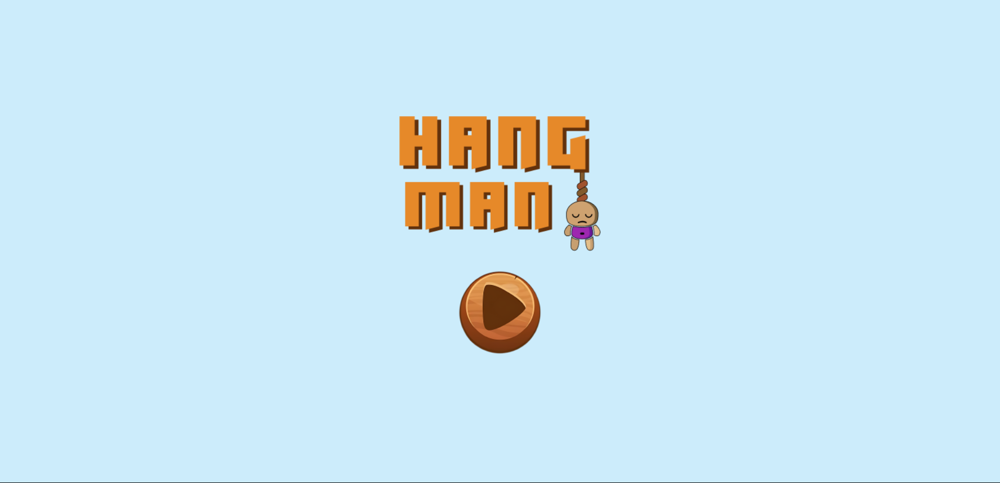
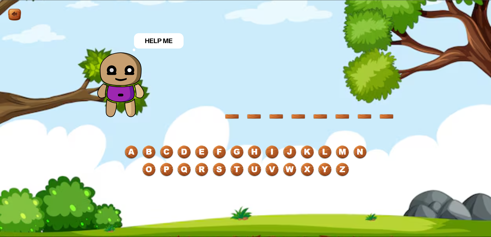
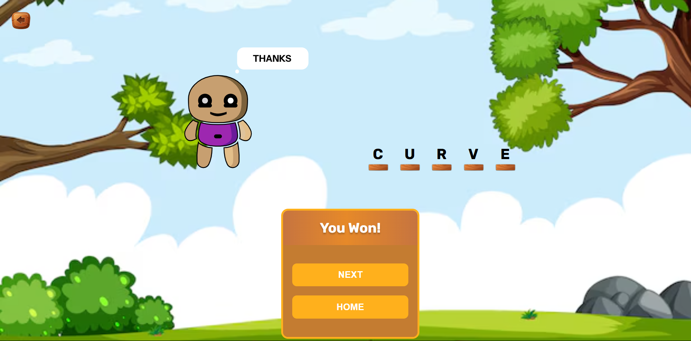
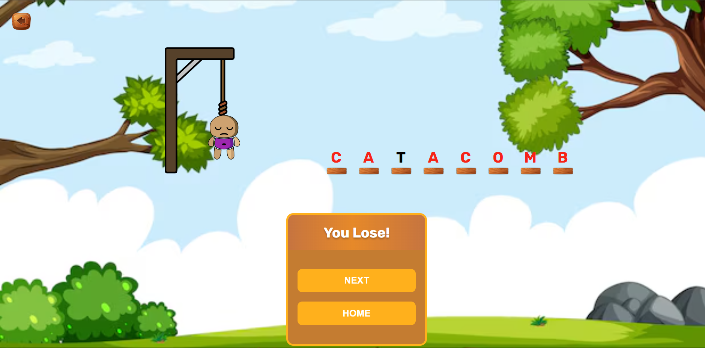

# 🎯 Word Guessing Game - React

A hangman-style word guessing game built with React, featuring a custom on-screen keyboard, SVG-based hangman drawing, persistent game state, and clean UI transitions. Have fun guessing random words fetched from an API, and try not to lose!

## 🖼️ Features

- **Home Page:** Includes a logo and a "Start Game" button.
- **Random Word Fetching:** Words are fetched from an external API when the game starts.
- **Word Representation:** The unknown word is displayed as lines based on letter count.
- **Custom Keyboard:** On-screen keyboard to enter guesses.
- **Hangman SVG Drawing:** A part of the hangman appears with each wrong guess (up to 6 tries).
- **Game End:** Shows win/lose screen and disables the keyboard.
- **Replay & Navigation:** Buttons to play again or return to the home screen.
- **Persistent State:** Even if the user refreshes or switches tabs, the current game and guesses persist.

## 🛠️ Built With

- **React.js** – UI and component structure
- **JavaScript (ES6+)** – Logic and interactivity
- **CSS** – Styling (mention which one you used)
- **LocalStorage** – To persist game state across reloads
- **REST API** – For fetching random words

## 📦 Installation

```bash
# Clone the repository
git https://github.com/sridharsrk/wordGuessGame.git
cd word-guessing-game

# Install dependencies
npm install

# And run the project
npm run dev
```

## 🧠 How to Play
```markdown
1. Click "Start Game" to begin.
2. A random word will appear as blank lines.
3. Use the on-screen keyboard to guess letters.
4. For every wrong guess, a part of the hangman is drawn.
5. You get 6 chances in total. Guess the full word before you lose!
```

## 📸 Screenshots

### 🏠 Home Screen

### 🎮 Game Screen

### ✅ Win Screen

### ❌ Lose Screen
